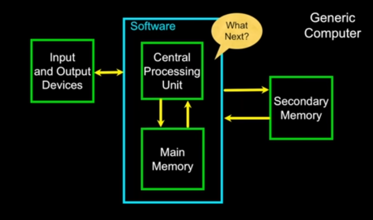

# Day 02

## Chapter 01 - Why Program? 

### Hardware Architecture


## Definitions

- Central Processing Unit: Runs the Program - The CPU is always wondering "what to do next". Not the brains exactly - very dumb but very very fast.
- Input Devices: Keyboard, Mouse, Touch Screen
- Output Devices: Screen, Speakers, Printer, DVD Burner.
- Main Memory: Fast small temporary storage - lost on reboot - aka RAM.
- Secondary Memory: Slower large permanent storage - lasts until deleted - disk drive / memory stick.

## Connects with [Harry Potter Reference](https://harrypotter.fandom.com/wiki/Parseltongue) (!really)

Parseltongue is the language of serpents and those who can converse with them. An individual who can speak Parseltongue is know as a Parselmouth. It is a very uncommon skill, and may be hereditary. Nearly all known Parselmouths are descended from **Salazar Slytherin** 

## About Python

Python is the language of the Python Interpreter and those who can converse with it. An individual who can speak Python is know as a **Pythonista**. It's a very uncommon skill, and may be hereditary. Nearly all known **Pythonistas** use software initially developed by **Guido van Rossum**.

## Early Learner: Syntax Errors

- We need to learn the Python language so we can communicate our instructions to Python. In the beginning we will make lots of mistakes and speak gibberish like small children.
- When you make a mistake, the computer does not think you are "cute". It says "syntax error" - given that it knows the language and you are just learning it. It seems like Python is cruel and unfeeling.
- You must remember that you are intelligent and can learn. The computer is simple and very fast, but cannot learn. So it's easier for you to learn Python than for the computer to learn English...

## Elements of Python

- Vocabulary / Words - Variables and Reserved words (Chapter 2)
- Sentence structure - valid syntax patterns (Chapters 3 - 5)
- Story Structure - constructing a program for a purpose

## Reserved Words 

- You cannot use reserved words as variable names / identifiers

```
False   class   return  is      finally
None    if      for     lambda  continue
True    def     from    while   nonlocal
and     del     global  not     with
assert  else    import  pass    
break   except  in      raise
```

## Sentence or Lines

```
x = 2       // Assignment statement
x = x + 2   // Assignment with expression
print(x)    // Print statement 
```

## Python Scripts

- Interactive Python is good for experiments and programs of 3-4 lines long.
- Most programs are much longer, so we type them, into a file and tell Python to run the commands in the file.
- In a sense, we are "giving Python a script".
- As a convention, we add ".py" as the suffix on the line end of these files to indicate they contain Python.

## Interactive vs. Script

- Interactive
    - You type directly to Python one line at a time and it responds.
- Script
    - You enter a sequence of statements (lines) into a file using a text editor or tell Python to execute the statements in the file.

## Program Steps or Program Flow

- Like a recipe or installation instructions, a program is a sequence of steps to be done in order.
- Some slaps are conditional - they may be skipped
- Sometimes a step ot group of steps is to be repeated.
- Sometimes we store a set of steps to be used over and over as needed several places throughout the program (Chapter 4). 

### Conditional Steps:


### Repeated Steps:

