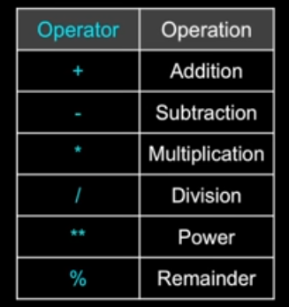

# Chapter 02 - Variables, Expressions, and Statements

## Constants

- **Fixed values** such as numbers, letters, and strings, are called **"called"** because their value does not change.
- Numeric **constants** are as you expect.
- String **constants** use single quotes (') or double quotes (").

## Variables

- A **variable** is a named place in the memory where a programmer can store data and later retrieve the data using the **variable** "name".
- Programmers get to choose the names of the **variables**
- You can change the contents of a **variable** in a later statement.
```
x = 12.2
y = 14
x = 100
```

### Python Variables Name Rules

- Must start with a letter or underscore _
- Must consist of letters, numbers, and underscores
- Case Sensitive
    ```
    Good:       spam        eggs        spam23      _speed
    Bad:        23spam      #sign       var.12
    Different:  spam        Spam        SPAM
    ```

### [Mnemonic](https://en.wikipedia.org/wiki/Mnemonic) Variable Names

- Since we programmers are given a choice in how we choose our variable names, there is a bot of "best practice".
- We name variables to help us remember what we intend to store in them ("mnemonic" = "memory aid")
- This can confuse beginning students because well-named variables often "sound" so good that they must be keywords.

## Expressions

### Numeric Expressions

- Because of the lack of mathematical symbols on computer keyboards - we use "computer-speak" to express the classic math operations.
- Asterisk is multiplication.
- Exponentiation (raise to power) looks different than in math.



### Order of Evaluation

- When we string operators together - Python mut know which one to do first.
- This is called **Operator Precedence**.
- Which operator "takes precedence" over the others?

```
x = 1 + 2 * 3 - 4 / 5 ** 6
```

### Operator Precedence
 
- Remember the rules to top to bottom
- When writing code - use parenthesis
- When writing code - keep mathematical expressions simple enough that they are easy to understand.
- Break long series of mathematical operations up to make them more clear.

Highest precedence rule to lowest precedence rule: **(PEDMAS)**
- Parenthesis are always respected
- Exponentiation (raise to a power)
- Division, Multiplication, & Remainder
- Addition and Subtraction
- Left to right


### Assignment Statements

- We assign a value to a variable using the assignment statement (=).
- An assignment statement consists of an expression on the right-hand side and a **variable** to store the result.

```
x = 3.9 * x * (1 - x)
```

### What does "Type" Mean?

- In Python variables, literals, and constants have a **"type"**
- Pythons knows the **difference** between an integer number and a string
- For example **"+"** means "addition" if something is a number and "concatenate" if something is a string. **(concatenate = put together)**
- Some operations are prohibited.
- **You cannot "add 1" to a string**
- We can ask Python what type something is by using the **type()** function.

### Several Types of Numbers

- Numbers have two main types
    - Integers are whole numbers: -14, -2, 0, 1, 100, 401233
    - Floating Point Numbers have decimal parts: -2.5, 0.0, 98.6, 14.0

- There are other number types - they are variations on float and integer.

### Type Conversions

- When you put an integer and floating point in an expression, the integer is implicitly converted to a float.
- You can control this with the built-in functions int() and float().

### Integer Division

- [Integer division](./py4e/int-div.py) produces a floating point result.

## Statements

### String Conversions

- You can also use int() and float() to convert between strings and integers.
- You will get an **error** if the string does not contain numeric characters.

### User Input 

- We can instruct Python to pause and read data from the user using the input() function
- The input() function returns a string

```
name = input('Who are you');
print('Welcome', name)
```

### Converting User Input

- If we want to read a number from the user, we must convert it from a string to a number using a type conversion function.
- Later we will with bad input data

```
inp = input('Europe floor?')
usf = int(inp) + 1
print('US floor', usf)
```

### Comments in Python

- Anything after a # is ignored by Python
- Why comment?
    - Describe what is going to happen in a sequence of code
    - Document who wrote the code or other ancillary information
    - Turn off a line of code - perhaps temporarily.
