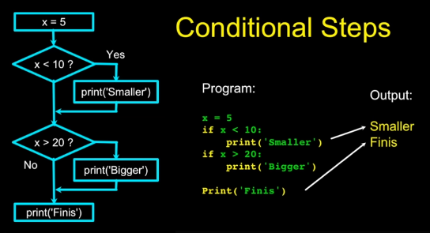
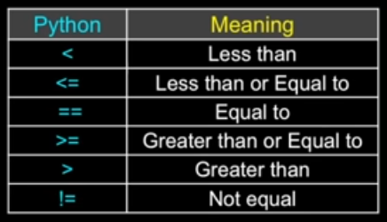

# Chapter 03 - Conditional Execution

## [Conditional Steps](./py4e/conditionals.py)

## Comparison Operators

- Boolean expression ask a question and produce a Yes or No result which we use to control program flow.
- Boolean expression using **comparison operators** evaluate to True/False or Yes/No.
- Comparison operators look at variables but do not change the variables.
- **Remember: `=` is used for assignment.**

### Indentation

- **Increase indent** indent after an if statement or for statement (after:).
- **Maintain indent** to indicate the **scope** of the block (which lines are affected by the if/for).
- **Reduce indent** back to the level of the if statement or for statement to indicate the end of the block.
- Blank lines are ignored - they do not affect **indentation**.
- Comments on a line by themselves are ignored with regard to **indentation**.

### Warning: Turn Off Tabs!!

- VS Code automatically uses spaces for files with `.py` extension (nice!)
- Most text editors can turn tabs into spaces - make sure to enable this feature
    - Notepad++: Settings -> Preferences  -> Language Menu/**Tab** Settings
    - BBEdit: BBEdit -> Preferences -> Editor Defaults
- Python cares a \*lot\* about how far a line is indented. If you mix **tabs** and **spaces**, you may get **"indentation errors"** even if everything looks fine.